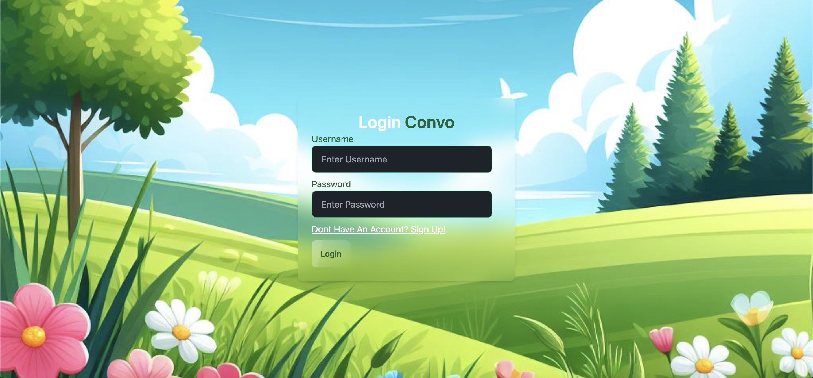
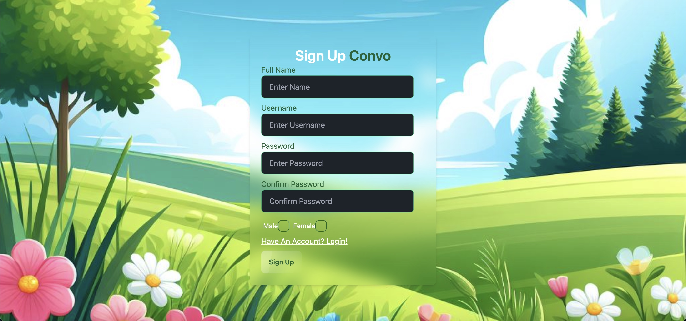
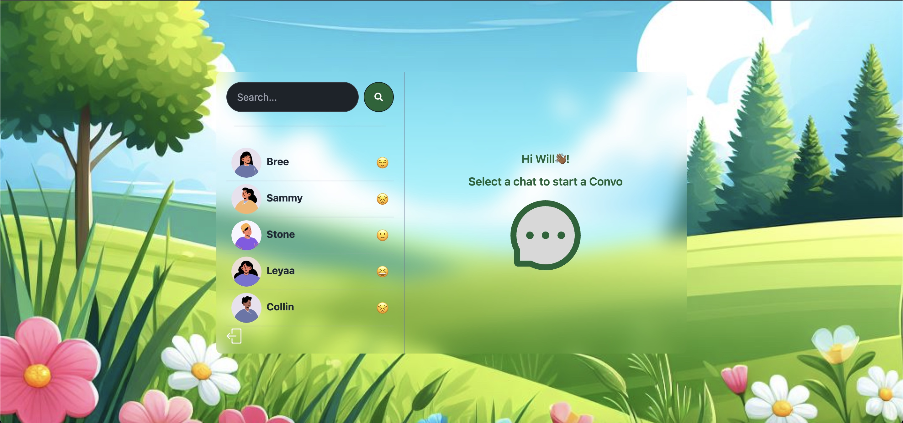
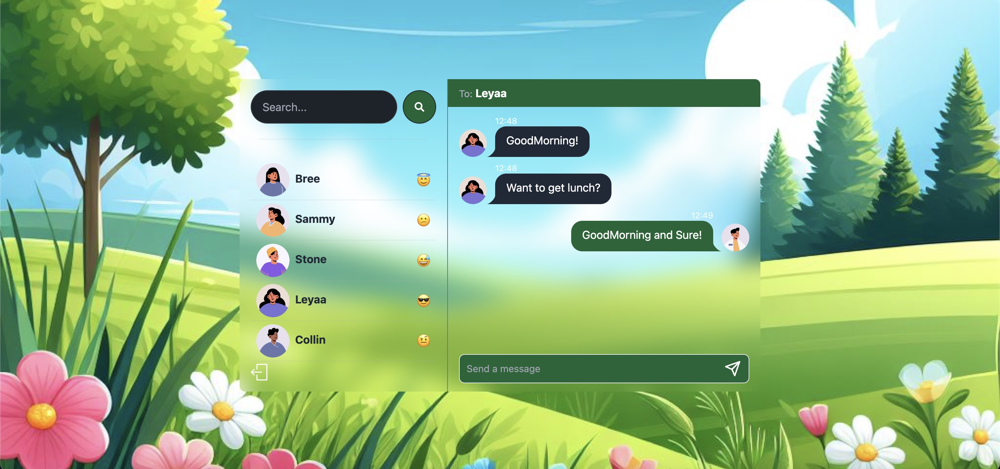
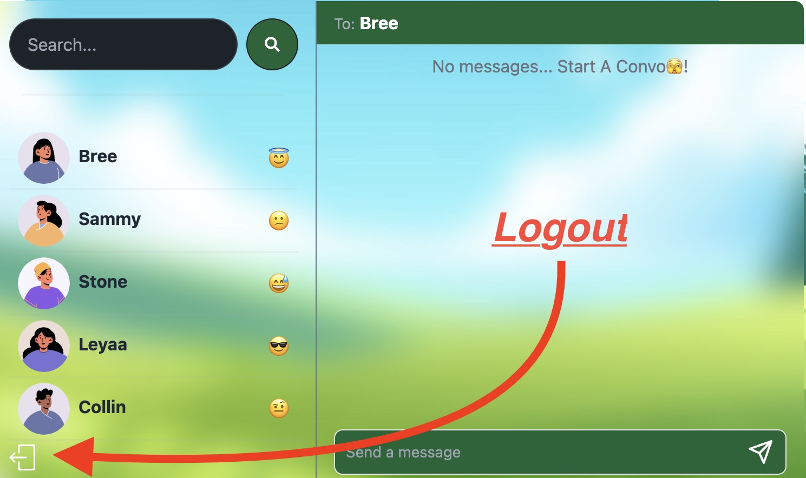

# Convo-App

## Description
The Convo App is for small talk. Connect with users on the App!.. Send a message, connect, and build relationships.

## Table of Contents

- [How To Use](#how-to-use)
- [Tech](#tech-used)
- [Contributors](#contributors)
- [Licensing](#license)

## How To Use

### 1. Login/SignUp

To Login or Sign up Click Here: https://convo-on6g.onrender.com/

### 2. Start a Conversation

Just Click a user and Send a Message

### 3. Logout

Just sign Out when you're done

## Tech Used

- MongoDB
- Mongoose ODM
- Express.js
- React.js
- Node.js
- JWT Authentication 
- Socket.io
- Tailwind CSS
- DaiseyUI

## Contributors
n/a

## License
n/a